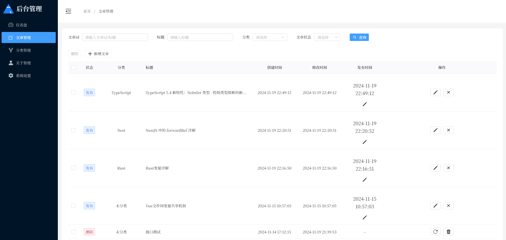

# HsBlog

一个简介风格的个人博客系统，包含前后台。

## :wrench: 技术栈

- Nuxt3
- Vue3
- Typescript
- UnoCSS
- Naive-UI
- Scss

## 启动

确保安装了依赖项：

```bash
# pnpm
pnpm install
```

## 开发服务器

```bash
pnpm run dev
```

启动开发服务器 `http://localhost:8800`:

## Production

构建用于生产的应用程序：

```bash
# pnpm
pnpm run build
```

本地预览生产构建：

```bash
# pnpm
pnpm run preview
```

## 后台管理面板

### 仪表盘


### 文章管理



### 分类管理


### 关于管理


## 前台页面


> [个人网站](http://47.98.158.27/) · GitHub [@HuoShan](https://github.com/huoshan25/)

